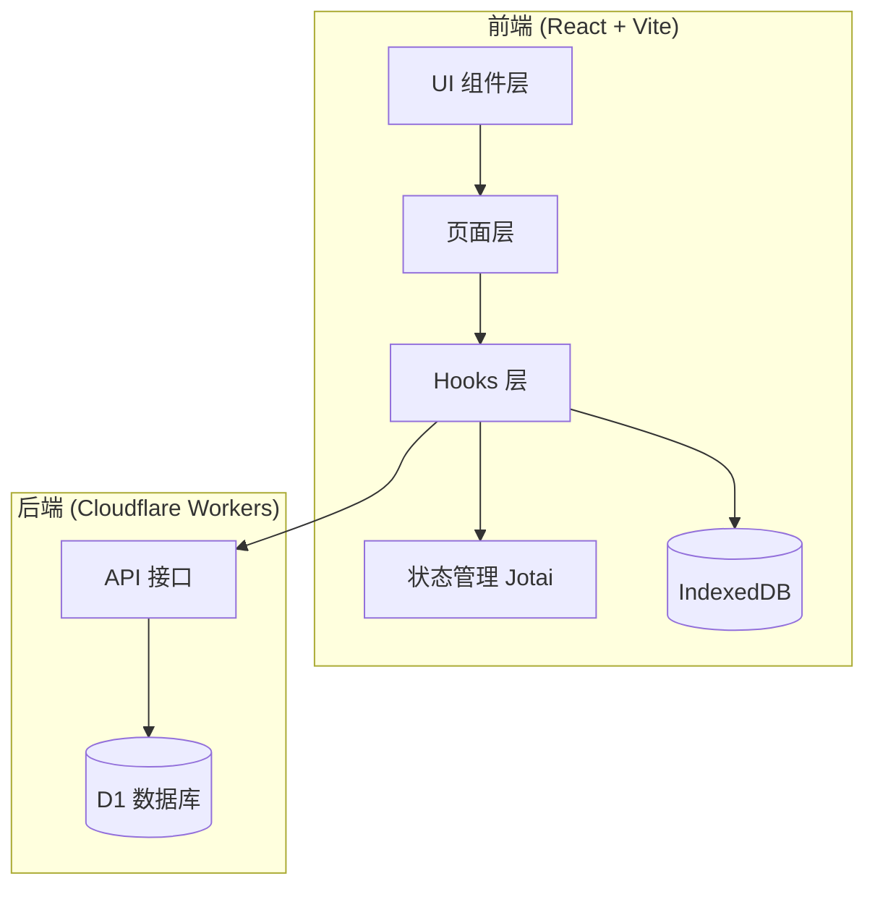

# 老九背单词 - 开发文档

> 一个基于 React + TypeScript 的英语单词学习应用，支持多种练习模式、云端同步、游戏化激励等功能。

---

## 📋 目录

1. [项目概述](#项目概述)
2. [技术架构](#技术架构)
3. [项目结构](#项目结构)
4. [功能模块详解](#功能模块详解)
5. [数据存储](#数据存储)
6. [状态管理](#状态管理)
7. [API 接口](#api-接口)
8. [部署说明](#部署说明)

---

## 项目概述

### 项目名称

**老九背单词** (Qwerty Learner Fork)

### 核心定位

一款面向小学到初中学生的译林版英语单词学习工具，提供多种创新练习模式，支持错题本、云端同步、学习统计等功能。

### 主要特性

- 📚 **7 本译林版词典**：覆盖小学 3A 到初中 9A
- 🎮 **7 种练习模式**：从打字背诵到填字游戏
- 📊 **学习统计**：日历热力图、练习时长、正确率统计
- ☁️ **云端同步**：多设备数据同步
- 🏆 **游戏化系统**：积分、成就、每日挑战
- 📱 **响应式设计**：支持 PC、iPad、iPhone

---

## 技术架构

### 技术栈总览

| 类别           | 技术                       | 用途             |
| -------------- | -------------------------- | ---------------- |
| **前端框架**   | React 18                   | UI 组件化开发    |
| **开发语言**   | TypeScript                 | 类型安全         |
| **构建工具**   | Vite                       | 快速开发与打包   |
| **状态管理**   | Jotai                      | 原子化状态管理   |
| **路由**       | React Router v6            | 单页应用路由     |
| **样式**       | TailwindCSS                | 原子化 CSS       |
| **本地数据库** | IndexedDB (Dexie.js)       | 客户端持久化存储 |
| **图表**       | ECharts                    | 学习统计可视化   |
| **音频**       | Howler.js + Web Speech API | 单词发音         |
| **图标**       | Iconify + Lucide React     | 图标库           |
| **桌面端**     | Tauri                      | 桌面应用封装     |
| **后端**       | Cloudflare Workers         | Serverless API   |
| **后端数据库** | Cloudflare D1 (SQLite)     | 云端数据存储     |
| **测试**       | Playwright                 | E2E 测试         |

### 架构图



---

## 项目结构

```
Memorize-words/
├── src/                          # 前端源代码
│   ├── @types/                   # TypeScript 类型扩展
│   ├── assets/                   # 静态资源（图片、字体）
│   ├── components/               # 公共组件 (15+)
│   │   ├── Header/              # 顶部导航栏
│   │   ├── Footer/              # 页脚
│   │   ├── LoginModal/          # 登录弹窗
│   │   ├── WordPronunciationIcon/ # 发音图标组件
│   │   ├── PortraitWarning/     # 竖屏警告
│   │   ├── ui/                  # 基础 UI 组件 (Radix UI)
│   │   └── ...
│   ├── hooks/                    # 自定义 Hooks (13个)
│   │   ├── useCloudSync.ts      # 云端同步逻辑
│   │   ├── usePronunciation.ts  # 单词发音
│   │   ├── useFastPronunciation.ts # 快速发音（预加载）
│   │   ├── useKeySounds.ts      # 按键音效
│   │   ├── useFocusMonitor.ts   # 页面焦点监控
│   │   ├── useGamification.ts   # 游戏化系统
│   │   ├── useSessionPersistence.ts # 会话持久化
│   │   └── ...
│   ├── pages/                    # 页面模块 (12个)
│   │   ├── Typing/              # 主练习页面（核心）
│   │   ├── Gallery-N/           # 词典选择页
│   │   ├── ErrorBook/           # 错题本
│   │   ├── Statistics/          # 学习统计
│   │   ├── SmartLearning/       # 智能学习模式
│   │   ├── Profile/             # 个人中心
│   │   ├── Achievements/        # 成就页面
│   │   └── ...
│   ├── resources/                # 资源配置
│   │   ├── dictionary.ts        # 词典定义
│   │   └── soundResource.ts     # 音效资源
│   ├── store/                    # Jotai 状态原子
│   ├── utils/                    # 工具函数
│   │   ├── db/                  # 数据库操作
│   │   ├── spaced-repetition.ts # SM-2 间隔重复算法
│   │   ├── crosswordLayout.ts   # 填字布局算法
│   │   └── ...
│   └── typings/                  # TypeScript 类型定义
├── functions/                    # Cloudflare Workers 后端
│   ├── api/
│   │   ├── auth/                # 用户认证
│   │   ├── sync/                # 数据同步
│   │   └── admin/               # 管理接口
│   └── utils.ts                 # 后端工具函数
├── public/                       # 静态资源
│   ├── sounds/                  # 音效文件
│   └── yilin_*.json             # 词典数据文件
├── src-tauri/                    # Tauri 桌面端配置
├── tests/                        # E2E 测试
└── docs/                         # 文档
```

---

## 功能模块详解

### 1. 词典管理系统

#### 词典列表

| 词典 ID | 名称              | 词汇量 | 章节数 | 适用年级   |
| ------- | ----------------- | ------ | ------ | ---------- |
| Yilin3A | 译林版小学英语 3A | 126    | 8      | 小学三年级 |
| Yilin4A | 译林版小学英语 4A | 159    | 8      | 小学四年级 |
| Yilin5A | 译林版小学英语 5A | 148    | 8      | 小学五年级 |
| Yilin6A | 译林版小学英语 6A | 166    | 8      | 小学六年级 |
| Yilin7A | 译林版初中英语 7A | 417    | 8      | 初中一年级 |
| Yilin8A | 译林版初中英语 8A | 452    | 8      | 初中二年级 |
| Yilin9A | 译林版初中英语 9A | 760    | 18     | 初中三年级 |

#### 词典数据结构

```typescript
interface DictionaryResource {
  id: string // 唯一标识
  name: string // 显示名称
  description: string // 描述
  category: string // 分类
  tags: string[] // 标签
  url: string // 数据文件路径
  length: number // 总词汇量
  language: string // 语言
  languageCategory: string
  chapterLengths: number[] // 每章词汇数
}

interface Word {
  name: string // 单词
  trans: string[] // 翻译（数组）
  usphone: string // 美式音标
  ukphone: string // 英式音标
  notation?: string // 备注
}
```

---

### 2. 练习模式系统

#### 模式总览

| 模式         | 英文标识        | 描述                     | 交互方式   |
| ------------ | --------------- | ------------------------ | ---------- |
| **背默单词** | `typing`        | 看释义完整打出单词       | 键盘输入   |
| **单词填空** | `speller`       | 从乱序字母中选择正确字母 | 点击/拖拽  |
| **填字闯关** | `crossword`     | 十字填字游戏             | 键盘输入   |
| **英译中**   | `word-to-trans` | 看单词选择正确释义       | 三选一选择 |
| **中译英**   | `trans-to-word` | 看释义选择正确单词       | 三选一选择 |
| **听写模式** | `dictation`     | 听发音写单词             | 键盘输入   |
| **智能学习** | `smartLearning` | 交叉混合多种模式         | 混合交互   |

#### 2.1 背默单词 (Typing)

**核心组件**: `src/pages/Typing/components/WordPanel/`

**功能特点**:

- 显示单词释义和音标
- 用户通过键盘输入完整单词
- 实时高亮正确/错误字母
- 支持听写模式（隐藏单词）
- 完成后自动播放发音

**听写模式选项**:
| 类型 | 标识 | 描述 |
|------|------|------|
| 全隐藏 | `hideAll` | 隐藏所有字母 |
| 隐藏元音 | `hideVowel` | 只隐藏元音字母 |
| 隐藏辅音 | `hideConsonant` | 只隐藏辅音字母 |
| 随机隐藏 | `randomHide` | 随机隐藏部分字母 |

#### 2.2 单词填空 (Speller)

**核心组件**: `src/pages/Typing/components/SpellerGame/`

**功能特点**:

- 显示单词释义和空位
- 提供乱序字母选项
- 支持点击和拖拽两种交互
- 错误时显示视觉反馈
- 完成后自动发音

#### 2.3 填字闯关 (Crossword)

**核心组件**: `src/pages/Typing/components/CrosswordGame/`

**功能特点**:

- 自动生成十字填字网格
- 三个难度等级：3 词、6 词、12 词
- 智能布局算法确保单词交叉
- 点击单元格高亮当前单词
- 支持键盘导航

**布局算法**: `src/utils/crosswordLayout.ts`

#### 2.4 选择题模式

**组件位置**: `src/pages/Typing/components/WordPanel/`

**英译中 (word-to-trans)**:

- 显示英文单词
- 三个中文释义选项
- 选择正确释义

**中译英 (trans-to-word)**:

- 显示中文释义
- 三个英文单词选项
- 选择正确单词

#### 2.5 智能学习模式 (SmartLearning)

**核心模块**: `src/pages/SmartLearning/`

**功能特点**:

- 将单词分成小组（每组 5 词）
- 每组单词交叉复现多次
- 组合多种练习模式
- 记录每组学习详情

---

### 3. 错题本系统

**核心模块**: `src/pages/ErrorBook/`

#### 功能特点

| 功能         | 描述                        |
| ------------ | --------------------------- |
| **自动收录** | 练习中错误 3 次以上自动加入 |
| **手动管理** | 支持手动添加/移除单词       |
| **专项练习** | 可选择错题本进行针对性复习  |
| **自动移除** | 连续正确 3 次后自动移出     |
| **云端同步** | 错题数据支持多设备同步      |

#### 数据结构

```typescript
interface WordRecord {
  word: string // 单词
  dict: string // 词典 ID
  chapter: number // 章节
  wrongCount: number // 错误次数
  correctCount: number // 连续正确次数
  mistakes: LetterMistakes // 字母级错误记录
  timestamp: number // 最后更新时间
  mode: ExerciseMode // 练习模式
}
```

---

### 4. 学习统计系统

**核心模块**: `src/pages/Statistics/`

#### 统计维度

| 维度         | 描述                  | 可视化   |
| ------------ | --------------------- | -------- |
| **学习天数** | 连续打卡天数 (Streak) | 数字显示 |
| **学习日历** | 每日学习热力图        | 热力图   |
| **练习时长** | 每日/累计练习时间     | 折线图   |
| **单词数量** | 练习单词总数          | 柱状图   |
| **正确率**   | 各模式正确率          | 饼图     |
| **模式分布** | 各练习模式使用比例    | 饼图     |

#### 核心 Hooks

- `useWordStats`: 统计单词练习数据
- `useFocusMonitor`: 监控页面焦点时长（摸鱼时长）

---

### 5. 音频系统

#### 5.1 单词发音

**核心文件**:

- `src/hooks/usePronunciation.ts` - 标准发音
- `src/hooks/useFastPronunciation.ts` - 快速发音（预加载）

**发音来源**:

- 有道词典 API: `https://dict.youdao.com/dictvoice?audio={word}&type={0|1}`
- Web Speech API (备用)

**发音类型**:
| 类型 | 标识 | 描述 |
|------|------|------|
| 美音 | `us` | 美式发音 (type=0) |
| 英音 | `uk` | 英式发音 (type=1) |

#### 5.2 按键音效

**核心文件**: `src/hooks/useKeySounds.ts`

**音效类型**:

- 打字音效：键盘敲击声
- 正确提示音：完成单词时
- 错误提示音：输入错误时

**音效文件位置**: `public/sounds/`

---

### 6. 用户系统

#### 6.1 认证功能

**后端接口**: `functions/api/auth/`

| 接口                 | 方法 | 描述     |
| -------------------- | ---- | -------- |
| `/api/auth/register` | POST | 用户注册 |
| `/api/auth/login`    | POST | 用户登录 |

**用户数据结构**:

```typescript
interface UserInfo {
  userId: string
  username: string
  nickname: string
}
```

#### 6.2 云端同步

**核心文件**: `src/hooks/useCloudSync.ts`

**同步内容**:

- 单词练习记录
- 章节完成记录
- 错题本数据
- 成就数据
- 积分数据

**同步策略**:

- 自动同步：每分钟检查一次
- 手动同步：用户主动触发
- 增量同步：基于时间戳的增量更新

---

### 7. 游戏化系统

**核心文件**: `src/hooks/useGamification.ts`

#### 7.1 积分系统

| 行为         | 积分      |
| ------------ | --------- |
| 完成一个单词 | +1        |
| 完成一章     | +10       |
| 连续打卡     | +5 × 天数 |

#### 7.2 成就系统

| 成就     | 条件             |
| -------- | ---------------- |
| 初来乍到 | 完成首次练习     |
| 坚持不懈 | 连续打卡 7 天    |
| 词汇达人 | 累计练习 1000 词 |
| ...      | ...              |

#### 7.3 每日挑战

**模块**: `src/pages/DailyChallenge/`

- 每日随机挑战题目
- 限时完成
- 积分奖励

---

### 8. 界面功能

#### 8.1 主题系统

**核心状态**: `isOpenDarkModeAtom`

| 主题     | 描述           |
| -------- | -------------- |
| 明亮模式 | 默认白色背景   |
| 深色模式 | 黑色背景，护眼 |

#### 8.2 虚拟键盘

**组件**: `src/pages/Typing/components/VirtualKeyboard/`

- 显示标准 QWERTY 键盘布局
- 高亮当前需要按的键
- 适配无物理键盘的设备

#### 8.3 快捷键

| 快捷键             | 功能          |
| ------------------ | ------------- |
| `Tab`              | 显示/隐藏答案 |
| `Ctrl + J`         | 播放发音      |
| `Ctrl + Shift + ←` | 上一个单词    |
| `Ctrl + Shift + →` | 下一个单词    |
| `Enter`            | 下一个/确认   |

#### 8.4 响应式适配

**核心文件**: `src/hooks/useWindowSize.tsx`

| 设备        | 适配策略     |
| ----------- | ------------ |
| PC 桌面     | 完整功能     |
| iPad 横屏   | 优化布局     |
| iPad 竖屏   | 显示旋转提示 |
| iPhone 横屏 | 简化界面     |
| iPhone 竖屏 | 显示旋转提示 |

---

## 数据存储

### 本地数据库 (IndexedDB)

**核心文件**: `src/utils/db/index.ts`

使用 **Dexie.js** 封装 IndexedDB。

#### 数据表结构

| 表名                      | 用途         | 主键          |
| ------------------------- | ------------ | ------------- |
| `wordRecords`             | 单词练习记录 | `[dict+word]` |
| `chapterRecords`          | 章节完成记录 | `++id`        |
| `reviewRecords`           | 复习记录     | `++id`        |
| `spacedRepetitionRecords` | 间隔重复数据 | `[word+dict]` |
| `smartLearningRecords`    | 智能学习记录 | `++id`        |

### 云端数据库 (Cloudflare D1)

**Schema 文件**: `schema.sql`

#### 数据表

| 表名                        | 用途         |
| --------------------------- | ------------ |
| `users`                     | 用户信息     |
| `study_records`             | 每日学习记录 |
| `word_records`              | 单词练习记录 |
| `chapter_records`           | 章节完成记录 |
| `sync_data`                 | 同步数据快照 |
| `points_transactions`       | 积分流水     |
| `unlocked_achievements`     | 已解锁成就   |
| `daily_challenges`          | 每日挑战     |
| `review_records`            | 复习记录     |
| `spaced_repetition_records` | 间隔重复数据 |
| `smart_learning_records`    | 智能学习记录 |

---

## 状态管理

### Jotai 原子状态

**核心文件**: `src/store/index.ts`

#### 主要状态原子

| 原子                      | 类型           | 描述            |
| ------------------------- | -------------- | --------------- | ------------ |
| `currentDictIdAtom`       | `string`       | 当前选中词典 ID |
| `currentChapterAtom`      | `number`       | 当前章节索引    |
| `exerciseModeAtom`        | `ExerciseMode` | 当前练习模式    |
| `userInfoAtom`            | `UserInfo      | null`           | 登录用户信息 |
| `isSyncingAtom`           | `boolean`      | 是否正在同步    |
| `isOpenDarkModeAtom`      | `boolean`      | 深色模式开关    |
| `pronunciationConfigAtom` | `object`       | 发音配置        |
| `keySoundsConfigAtom`     | `object`       | 按键音效配置    |
| `wordDictationConfigAtom` | `object`       | 听写模式配置    |
| `randomConfigAtom`        | `object`       | 随机顺序配置    |
| `loopWordConfigAtom`      | `object`       | 循环次数配置    |
| `phoneticConfigAtom`      | `object`       | 音标显示配置    |
| `learningPlanAtom`        | `object`       | 学习计划配置    |
| `reviewModeInfoAtom`      | `object`       | 复习模式信息    |

---

## API 接口

### 后端 API (Cloudflare Workers)

**基础路径**: `/api`

#### 认证接口

| 路径                 | 方法 | 描述 | 参数                               |
| -------------------- | ---- | ---- | ---------------------------------- |
| `/api/auth/register` | POST | 注册 | `username`, `password`, `nickname` |
| `/api/auth/login`    | POST | 登录 | `username`, `password`             |

#### 同步接口

| 路径                 | 方法 | 描述                         | 参数 |
| -------------------- | ---- | ---------------------------- | ---- |
| `/api/sync`          | POST | 手动云备份上传（整库 blob）  | `data` |
| `/api/sync`          | GET  | 手动云备份下载（整库 blob）  | 无 |
| `/api/sync/upload`   | POST | 自动同步上传（结构化数据）   | `records` 等业务字段 |
| `/api/sync/download` | GET  | 自动同步下载（结构化数据）   | 无 |

> 所有同步接口都必须携带 `Authorization: Bearer <JWT>`，服务端会从 JWT 的 `sub` 解析用户身份，不能再通过请求里的 `userId` 指定目标账号。

---

## 部署说明

### 开发环境

```bash
# 安装依赖
npm install

# 启动开发服务器
npm run dev

# 运行 E2E 测试
npm run test:e2e
```

### 生产构建

```bash
# 构建前端
npm run build

# 部署到 GitHub Pages
npm run deploy
```

### Cloudflare Workers 部署

```bash
# 使用 Wrangler 部署
npx wrangler deploy
```

部署前需要在 Cloudflare 环境中配置以下变量：

| 变量 | 必填 | 说明 |
| ---- | ---- | ---- |
| `JWT_SECRET` | 是 | JWT 签名密钥；登录和所有受保护接口都会使用 |
| `ADMIN_USER_IDS` | 否 | 允许访问后台的用户 ID 白名单，多个值用逗号分隔 |
| `ADMIN_USERNAMES` | 否 | 允许访问后台的用户名白名单，多个值用逗号分隔 |

管理员后台不再使用共享密码。管理员需要先用普通账号密码登录，然后由服务端根据 `ADMIN_USER_IDS` 或 `ADMIN_USERNAMES` 判断该账号是否具备后台权限。

### Tauri 桌面应用

```bash
# 进入 Tauri 目录
cd src-tauri

# 构建桌面应用
cargo tauri build
```

---

## 附录

### A. 文件索引

| 文件/目录                    | 描述          |
| ---------------------------- | ------------- |
| `src/index.tsx`              | 应用入口      |
| `src/pages/Typing/index.tsx` | 主练习页面    |
| `src/hooks/useCloudSync.ts`  | 云同步逻辑    |
| `src/utils/db/index.ts`      | 数据库操作    |
| `src/store/index.ts`         | 全局状态      |
| `functions/api/`             | 后端 API      |
| `schema.sql`                 | 数据库 Schema |
| `public/*.json`              | 词典数据      |

### B. 类型定义索引

| 类型            | 定义位置                  | 描述         |
| --------------- | ------------------------- | ------------ |
| `Word`          | `src/typings/index.ts`    | 单词数据结构 |
| `Dictionary`    | `src/typings/resource.ts` | 词典数据结构 |
| `ExerciseMode`  | `src/typings/index.ts`    | 练习模式枚举 |
| `WordRecord`    | `src/utils/db/record.ts`  | 单词记录     |
| `ChapterRecord` | `src/utils/db/record.ts`  | 章节记录     |

### C. 环境变量

| 变量                | 描述         | 默认值 |
| ------------------- | ------------ | ------ |
| `VITE_API_BASE_URL` | API 基础路径 | `/api` |
| `JWT_SECRET` | JWT 签名密钥 | 无 |
| `ADMIN_USER_IDS` | 管理员用户 ID 白名单 | 无 |
| `ADMIN_USERNAMES` | 管理员用户名白名单 | 无 |

---

_文档生成时间: 2026-01-21_
